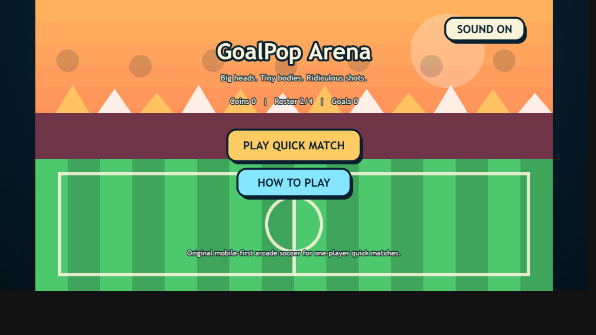
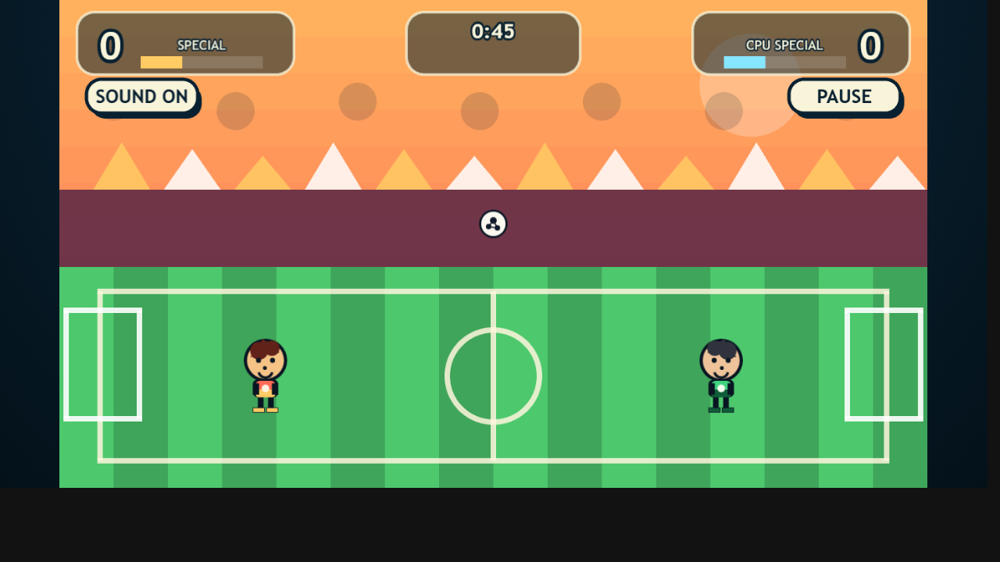

# GoalPop Arena Web

원작 IP를 복제하지 않고, 모바일 웹에 맞게 새로 만든 1대1 아케이드 축구 게임입니다.  
큰 머리 캐릭터, 짧은 경기, 단순한 조작, 파워샷과 필살기, 로컬 저장 기반 언락 구조를 MVP 범위로 구현했습니다.

게임 링크: [Play GoalPop Arena Web](https://seungmin-park-psm1757.github.io/game-for-son-6/)





## 핵심 특징

- Phaser 3 + TypeScript + Vite 기반의 가벼운 웹앱 구조
- `Boot -> Preload -> Title -> Character Select -> Match -> Result` 씬 흐름
- 4명의 오리지널 캐릭터
  - Blaze: `Fire Shot`
  - Bolt: `Dash Kick`
  - Atlas: `Wall Block`
  - Ripple: `Curve Touch`
- 2개의 경기장
  - Sunset Arena
  - Neon Night
- CPU 난이도 3단계
  - Easy / Normal / Hard
- 키보드 + 모바일 터치 조작 지원
- localStorage 기반 저장
  - 코인
  - 캐릭터 언락
  - 경기장 언락
  - 사운드 설정
  - 기본 전적
- 짧은 매치 흐름
  - 45초 정규 시간
  - 동점 시 15초 연장
  - 그래도 동점이면 골든골

## 조작법

### 데스크톱

- `A / D`: 좌우 이동
- `W`: 점프
- `Space`: 킥
- `Shift`: 필살기
- `Esc`: 일시정지

### 모바일

- 좌하단: 이동 버튼
- 우하단: 점프 / 킥 / 스페셜 버튼
- 우상단: 일시정지

## 진행 구조

- 기본 해금 캐릭터: Blaze, Bolt
- 추가 해금 캐릭터: Atlas, Ripple
- 경기 보상으로 코인을 획득
- 캐릭터 첫 승리 시 보너스 코인 지급
- 총 득점이 누적되면 `Neon Night` 경기장 해금

## 빠른 실행

배포 버전:

```text
https://seungmin-park-psm1757.github.io/game-for-son-6/
```

```bash
npm install
npm run dev
```

빌드 확인:

```bash
npm run build
```

단위 테스트:

```bash
npm test
```

배포용 미리보기:

```bash
npm run preview
```

## 디버그 진입점

QA와 스크린샷 확인을 위해 쿼리 파라미터 기반 빠른 진입을 지원합니다.

- `/?debug=select`: 캐릭터 선택 화면으로 바로 진입
- `/?debug=match`: 기본 매치 상태로 바로 진입

일반 플레이에는 필요 없습니다.

## 프로젝트 구조

```text
src/
  main.ts
  styles.css
  game/
    GameApp.ts
    constants/
    config/
    entities/
    scenes/
    services/
    systems/
    types/
    ui/
test/
docs/
```

## 구현 메모

- 그래픽은 외부 에셋 의존 대신 Phaser Graphics 기반 원본 도형/텍스처 생성 방식으로 구성했습니다.
- 경기 밸런스, 캐릭터, 경기장, 필살기 데이터는 설정 파일로 분리했습니다.
- 입력 처리, CPU AI, 필살기 처리, 저장 로직을 메뉴/씬 로직과 분리해 확장성을 유지했습니다.
- 사운드는 짧은 Web Audio 톤 시퀀스로 처리해 별도 음원 없이도 피드백이 나가도록 했습니다.

## 테스트 내역

완료:

- `npm run build`
- `npm test`
- Headless Chrome 스모크 확인
  - 타이틀 화면 렌더 확인
  - `/?debug=match` 경기 화면 렌더 확인

참고:

- 이 환경에서는 Playwright 브라우저 런치가 로컬 Chrome 정책 때문에 막혀 있어, 상호작용형 E2E 대신 headless Chrome 스크린샷 기반 스모크 검증으로 대체했습니다.

## 원본성 가이드

이 프로젝트는 캐주얼 빅헤드 축구 장르의 감각만 참고했고, 특정 게임/브랜드/선수/구단/국기/로고/UI를 복제하지 않았습니다.
